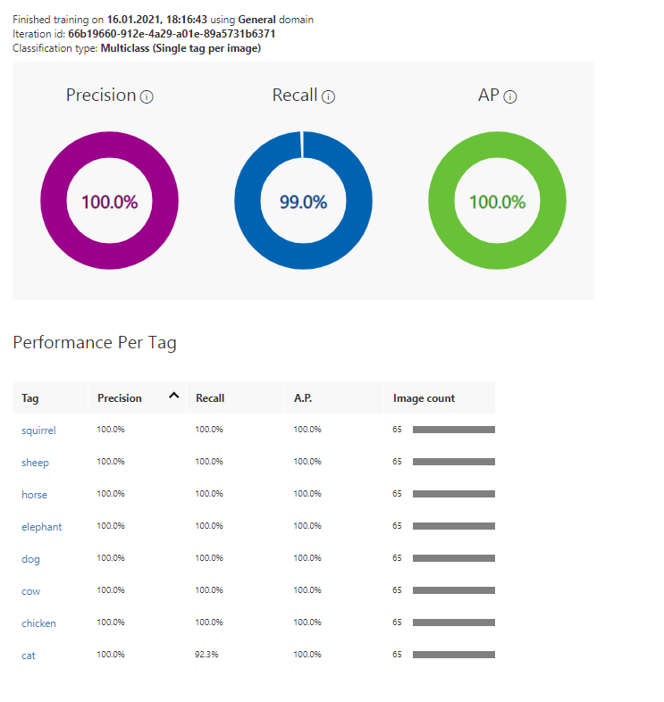
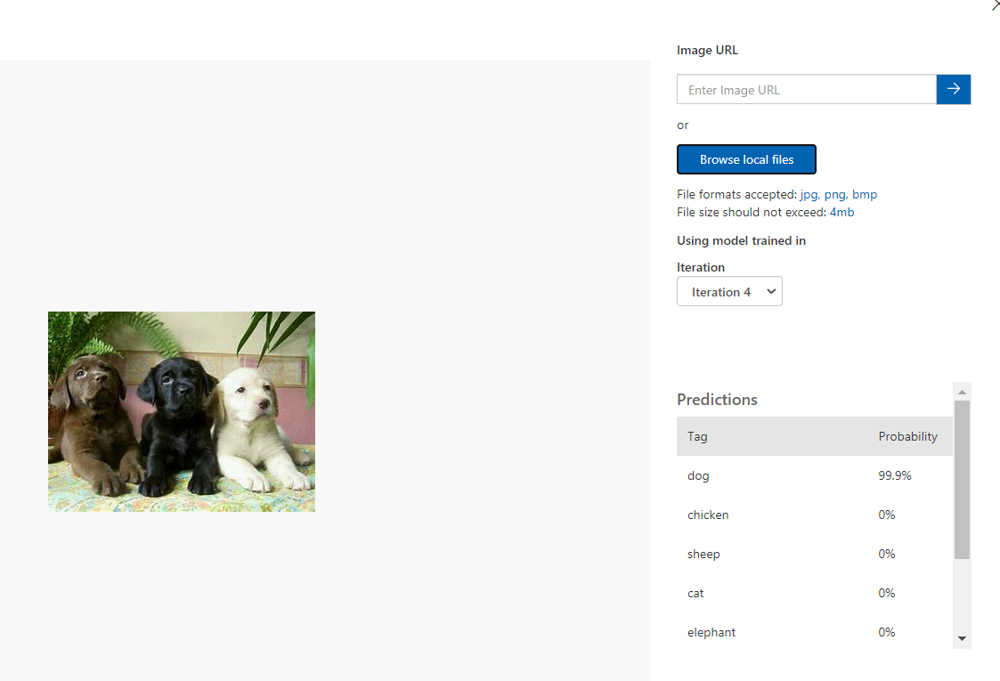
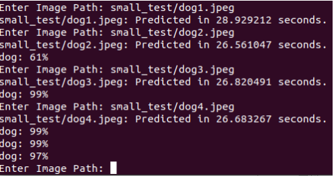
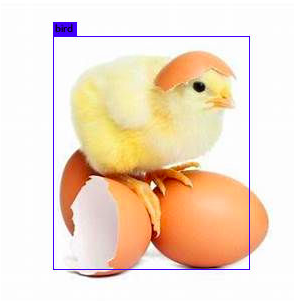
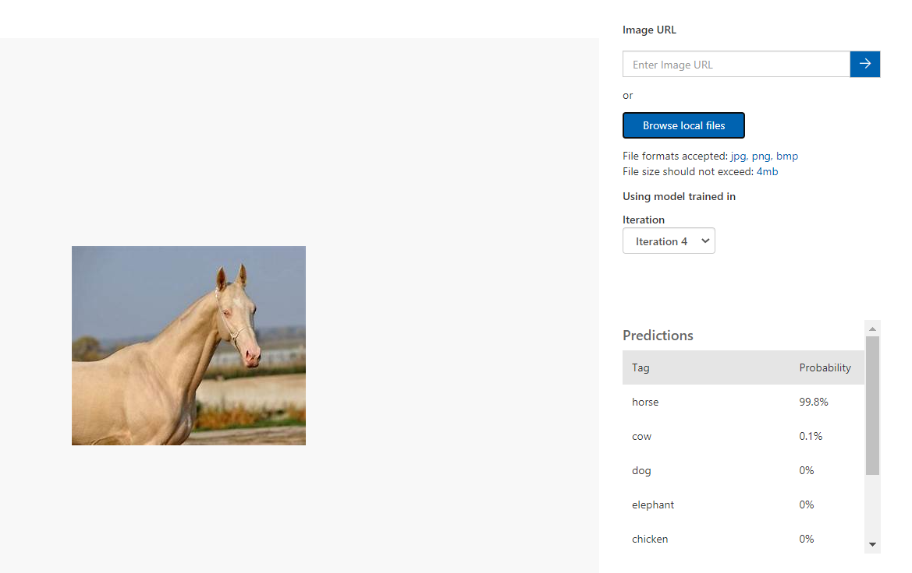
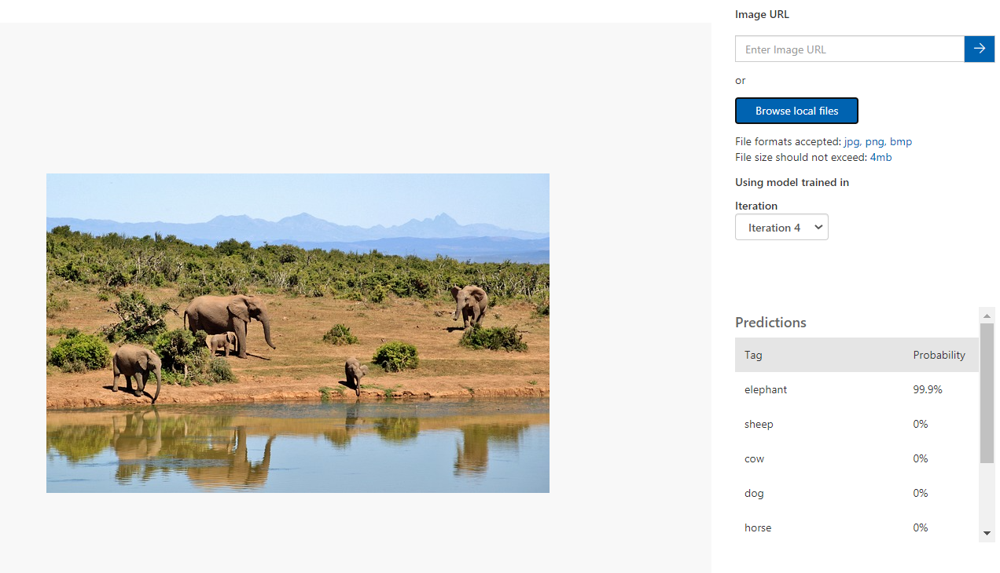

# Porównanie MS Custom Vision i YOLO na przykładach zwierząt
---
## Cel projektu
Celem tej pracy jest porównanie modeli MS Custom Vision i YOLO (v3) służących do klasyfikacji obiektów przedstawianych na obrazach. Porównywana była jakość klasyfikacji, różnice w sposobie klasyfikacji oraz łatwość w obsłudze. Przeprowadzone zostały dwa eksperymenty - pierwszy to rozpoznawanie wybranych gatunków zwierząt a drugi to wykrywanie obecności guzów w mózgu.

---
## Filmy

Model YOLO: https://youtu.be/39f2839Cwrg
Model MS Custom Vision: https://youtu.be/K8PuZs3XXqU

---
## Reprodukcja modelu YOLO

Model YOLO działa na każdym systemie operacyjnem, jednak na Linuxie jego instalacja jest znacznie prostrza. Potrzebne plik należy pobrać z oficjalnego tutoriala YOLO: https://pjreddie.com/darknet/yolo/. Są to framework darknet: https://github.com/pjreddie/darknet i wytrenowane wagi modelu: https://pjreddie.com/media/files/yolov3.weights.
Rozpoznawanie jest uruchamiane poleceniem: ./darknet detect cfg/yolov3.cfg yolov3.weights data/image_name

---
## Wnioski ogólne

Oba programy mają różny czas wykonywania i porównywanie ich jest mało praktyczne - MS CV działa na serwerze a YOLO jest wykonywane na maszynie lokalnej. Dodatkowo model YOLO uzyskuje do 100 krotnego przyśpieszenia pod warunkiem że wykorzystuje GPU Nvidy - wersja uruchomiona na potrzeby raportu działała na CPU na systemie Linuks. 

Wstępna analiza obu programów na prostym przykładzie zwierząt wykazała istotne różnice w ich działaniu. Model MS VC w przytłaczającej większości klasyfikował gatunki zwierząt z pewnością 99%-100% (tylko jeden wynik dla owcy był wyraźnie gorszy - 86%) i zawsze zgodnie z prawdą, natomiast model YOLO uzyskiwał taki poziom pewności wyraźnie rzadziej, dodatkowo zdarzało mu się dokonywać całkowicie błędnych klasyfikacji (z dużą pewnością) oraz nie dokładnych klasyfikacji (wszystkie kurczaki zaklasyfikowane jako 'ptak'). Czasami model UOLO nie był w stanie przypisać żadnego oznaczenia dla zadanego obrazu. 

Zaletą modelu YOLO jest z kolei zdolność do wyznaczania obszarów w których znajduje się zaklasyfikowany obiekt. Dodatkowo, model rozpoznaje gdy na obrazie znajduje się wiele zwierząt tego samego rodzaju. 

---
## Porównanie szczegółowe

Model YOLO wykożystywał ogólne wagi https://pjreddie.com/media/files/yolov3.weights

Model MS VC został wytrenowany przy podaniu po 65 zwierząt na każdy gatunek.

---
### Psy
### MS CV

---
### YOLO
\

Przykład obrazu (dog4) który został tak samo dobrze zaklasyfikowany.
---
### Koty
\
Jeden z kotów został nierozpoznany przez YOLO
 
---
### Kury
### MS CV

---
### YOLO
\

YOLO zaklasyfikował kury, kurczaki i koguty jako ptaki - zbyt ogólna kategoria.

---
### Krowy
### MS CV

---
### YOLO
\

Poduszka z obrazem krowy (cow1) została zaklasyfikowana jednocześnie jako krowa i owca przez YOLO. Krowa na obrazie cow2 została przez YOLO zaklasyfikowana jako koń.

---
### Owce
### MS CV

---
### YOLO

YOLO nie rozpoznał stada owiec (sheep1) i błędnie zaklasyfikował część obrazu.

---
### Konie
### MS CV

---
### YOLO
\

horse3 został zaklasyfikowany jednocześnie jako koń i osoba

---
### Słonie
### MS CV

---
### YOLO
\

Oba modele bardzo dobrze rozpoznały słonie, na obrazie elephant2 YOLO dodatkowo zaznaczył każdego ze słoni odzielnie
