# Porównanie MS Custom Vision i YOLO na przykładach nowotworu mózgu
---

## Cel ćwiczenia
Druga część ćwiczenia miała na celu porównanie działania obu modeli dla wyspecjalizowanego zbioru danych jakim są zdjęcia guzów w mózgu.

## Model YOLO

Aby móc skorzystać z tego modelu do klasyfikacji guzów należało stworzyć własne wagi dla sieci neuronowej na podstawie załączonych skanów mózgu. Okazało się to jednak trudnym zadaniem - oficjalny poradnik YOLO (https://pjreddie.com/darknet/yolo/) opisuje proces tworzenia własnych wag tylko dla zbiorów Pascal VOC i zbioru COCO - zaprezentowane są dedykowane skrypty generujące pliki potrzebne do stworzenia wag, jednak przypadek tworzenia wag z własnego zbioru danych nie jest uwzględniony.

## Instrukcja reprodukcji rozwiązania MS Custom Vision

1. Zaloguj się  do Azure portal https://portal.azure.com/ i stwórz resouce group  </b>

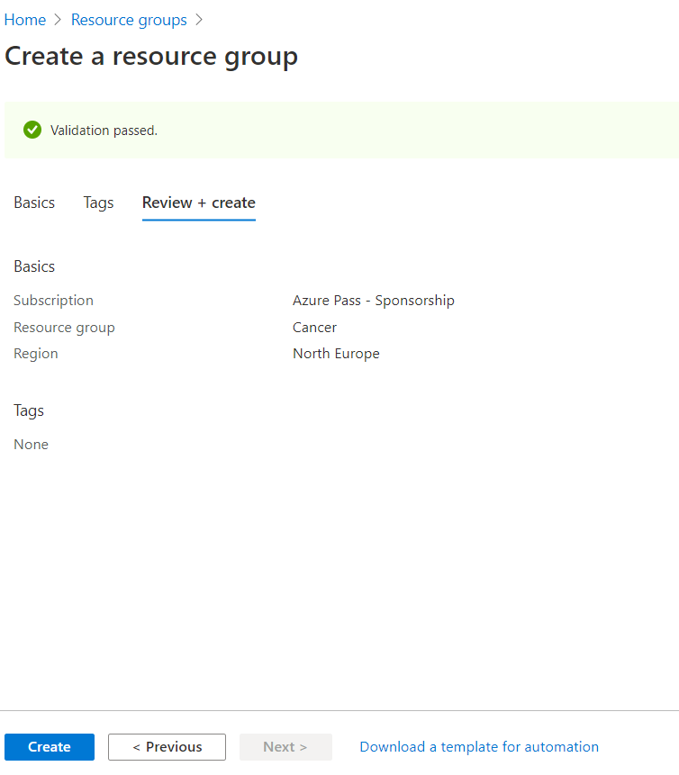

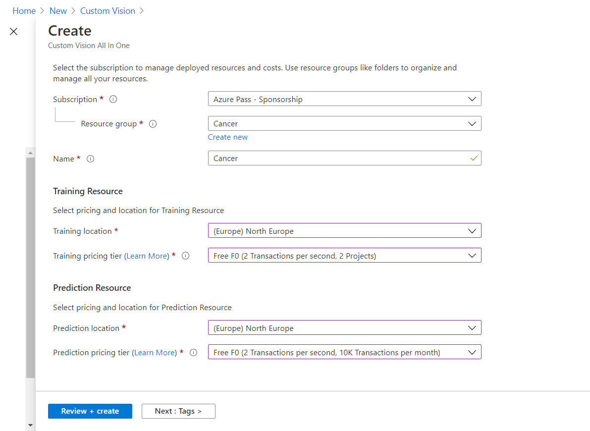

2. Wejdż do portalu usługi Custom Vision : https://www.customvision.ai/ i utwórz nowy projekt.

3. Stwórz tagi: cancer, no_tumor  i dodaj do nich obrazy. Obrazy znajdują się w folderze ./img/cancer. Z folderu należy pobrać i rozpakować, a następnie oznaczyć odpowiednim tagiem obrazy z plików: no_tumor_train.zip , cancer1.zip, cancer2.zip, cancer3.zip.

4. Wybierz przycisk Trenuj z górnej części strony. 

5. Po procesie trenowania nalezy przejść do etapu testowania.Model testujemy, klikając na przycisk szybki test i podając zdjęcie, które chcemy sklasyfikować. Obrazy testowe znajdują się w folderze ./img/cancer w  test.zip

## Wnioski ogólne
W porównaniu do wcześniejszego eksperymentu ze zwierzętami model MS Custom Vison wypadł gorzej - do uzyskania zadowalających rezultatów należało wgrać ponad 2000 obrazów zawierających nowotwór i ponad 300 zdjęć mózgu bez nowotworu (przy mniejszych liczbach zdjęć w zbiorze treningowym przewidywania były niejednoznaczne i nie można było na nich polegać). Dodatkowo model jest mniej pewny niż przy zwierzętach - bardzo popularne są wyniki rzędu 95%. Dodatkowo pierwsze zdjęcie z zbioru testowego nie no_tumor zostało błędnie zaklasyfikowane jako posiadające raka (55,3% cancer). Pokazuje to że model nie jest doskonały i że błędy są możliwe.

Model YOLO okazał się zbyt trudny w realizacji - jedyny wniosek jest taki że MS Custom vision jest znacznie prostrzy w obsłudze od modelu YOLO.

## Architektura
Custom vision

Yolo - YOLO składa się tylko i wyłącznie z frameworka darknet: https://github.com/pjreddie/darknet

## Porównanie szczegółowe

Model MS VC został wytrenowany przy podaniu 2044 obrazów z rakiem i 327 bez raka.

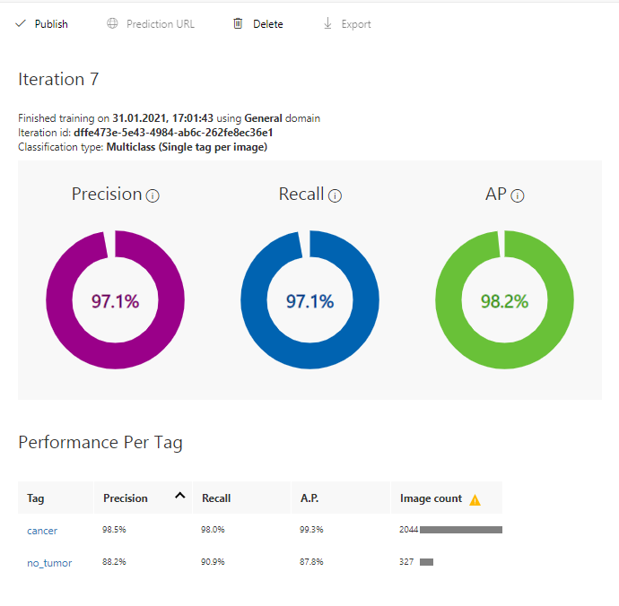
---
### Nowotwory (zbiór testowy)
### MS CV
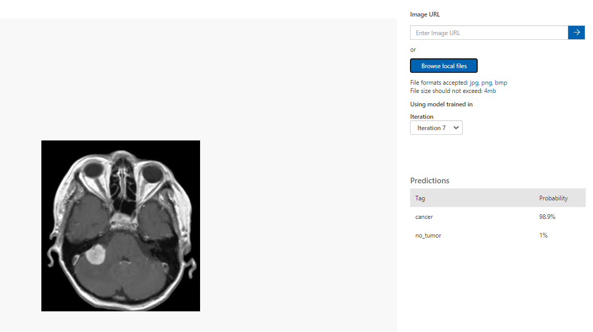

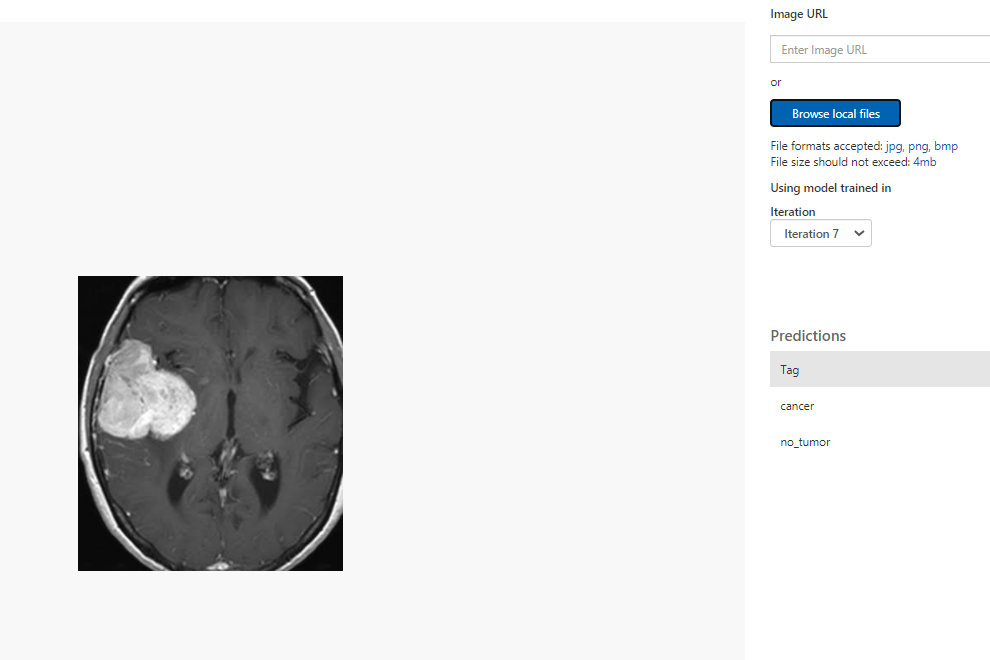

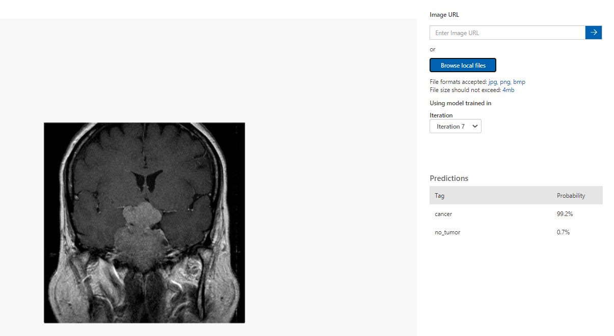

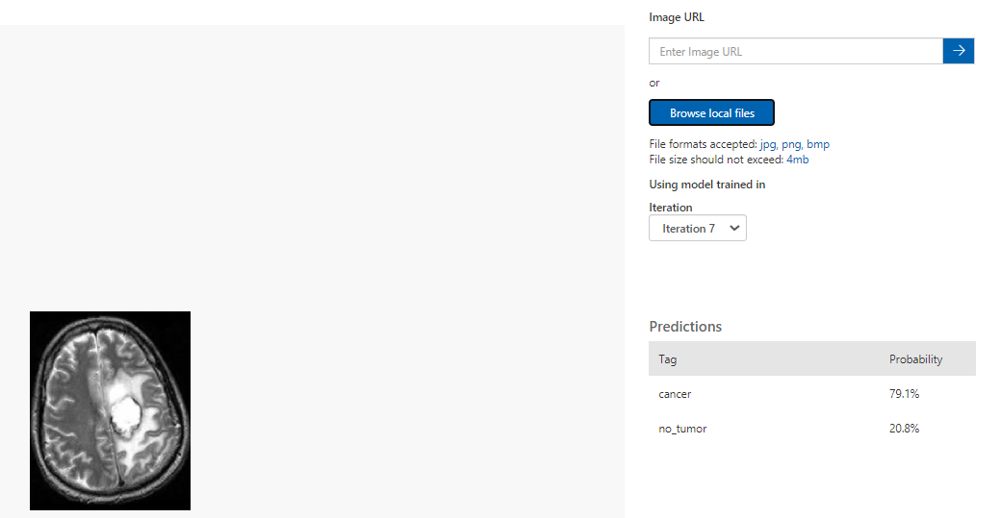

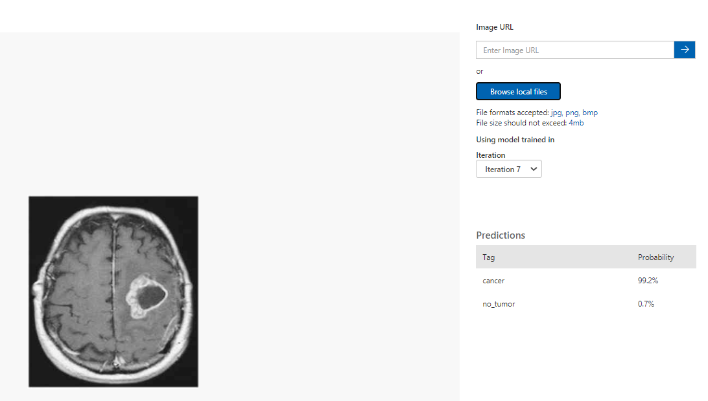

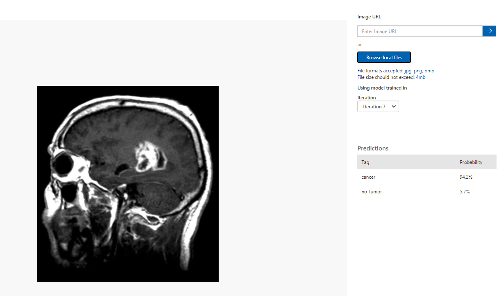

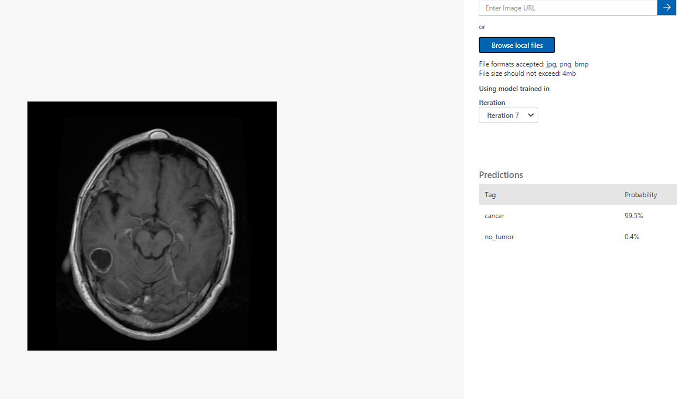

---

### Brak guza (zbiór testowy)
### MS CV
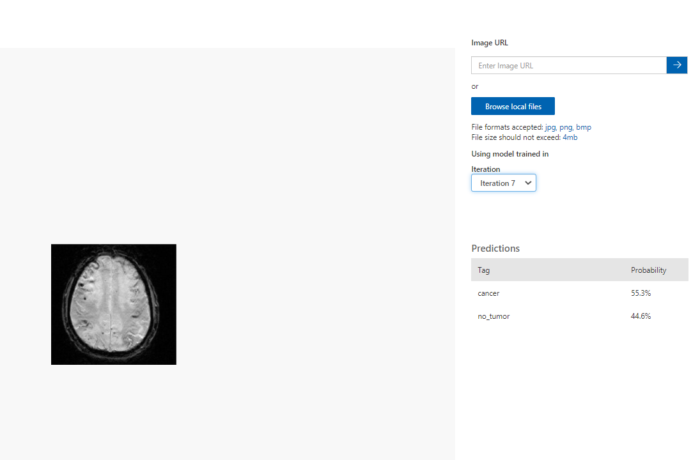
Pomyłka modelu - obraz bez raka został błędnie zaklasyfikowny jako zawierający raka.

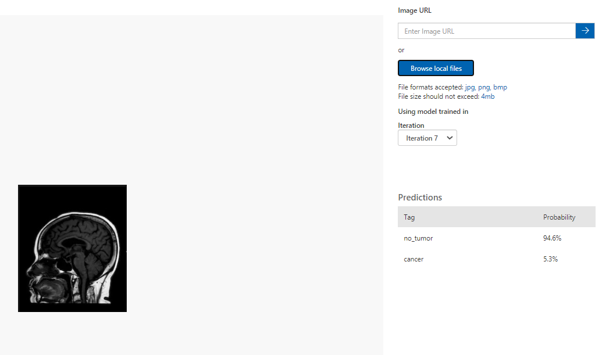

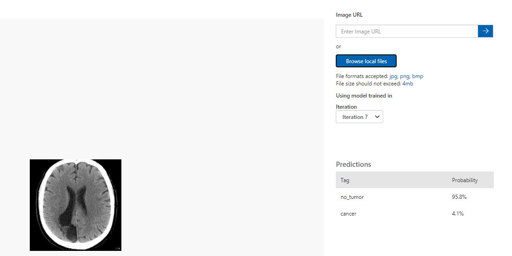

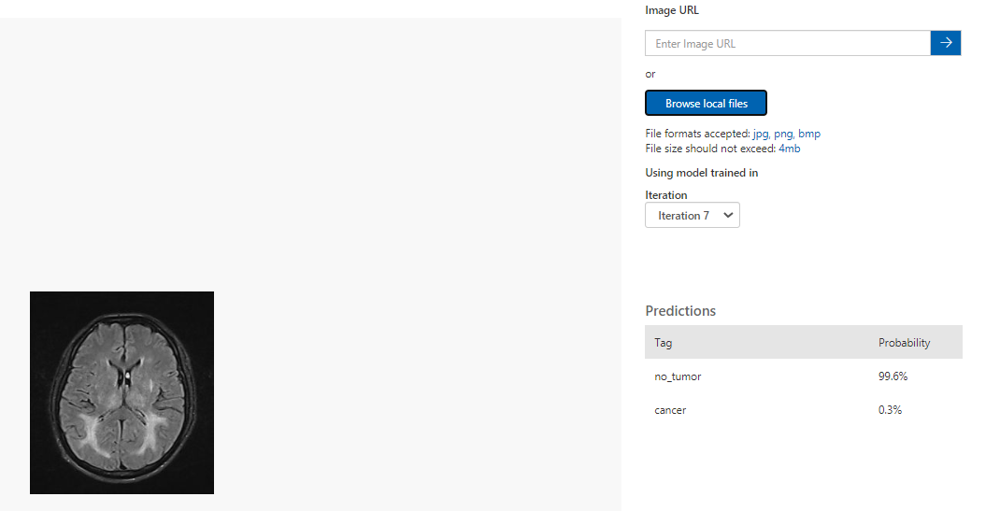

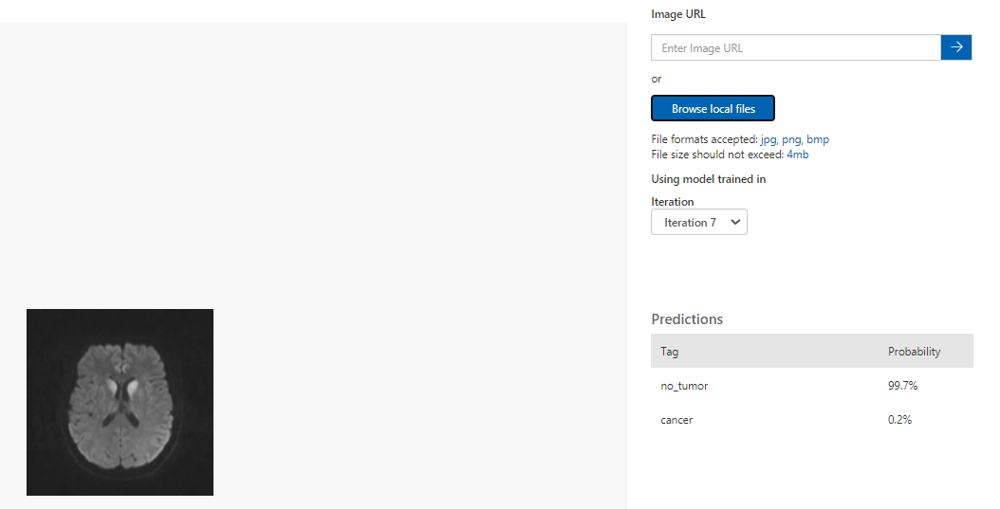

---

