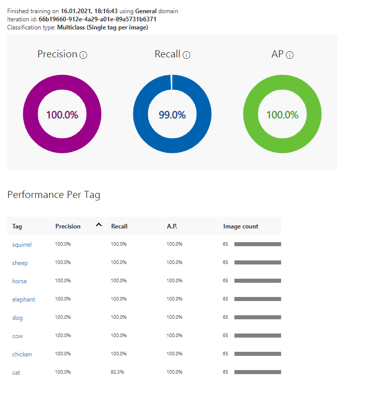
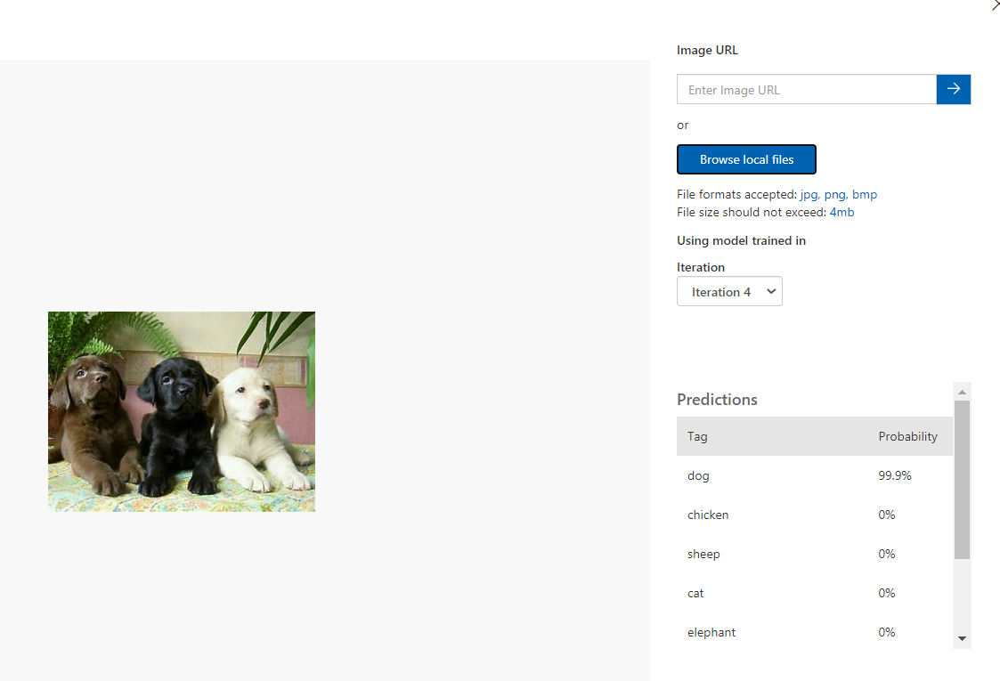

# Porównanie MS Custom Vision i YOLO na przykładach nowotworu mózgu
---
## Cel ćwiczenia

---
## Instrukcja reprodukcji rozwiązania

## Architektura
Custom vision

Yolo
## Porównanie szczegółowe

Model YOLO wykożystywał ogólne wagi https://pjreddie.com/media/files/yolov3.weights

Model MS VC został wytrenowany przy podaniu po 65 zwierząt na każdy gatunek.

---
### Psy
### MS CV

---
